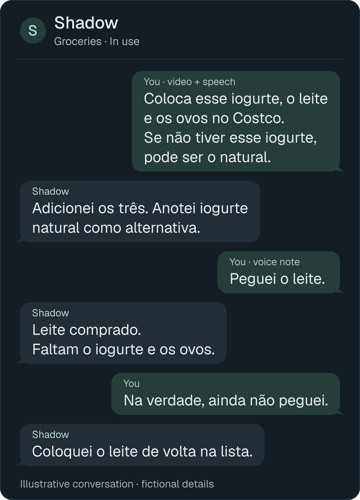
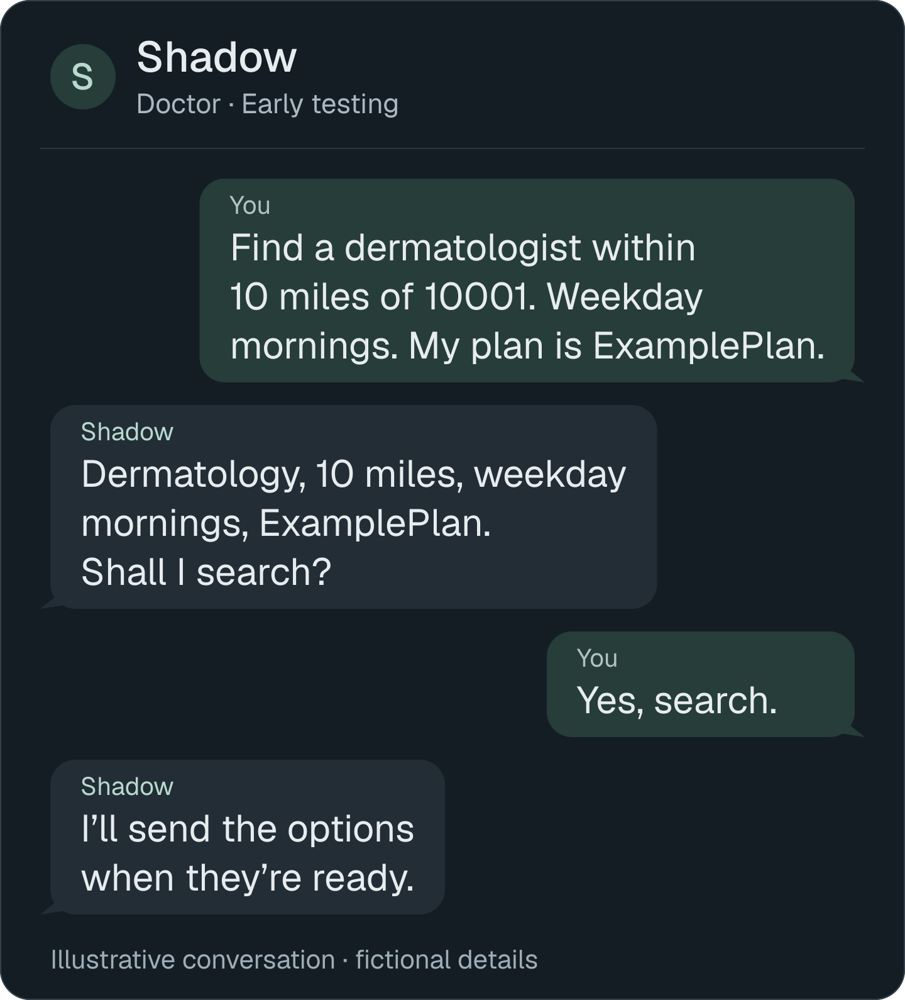
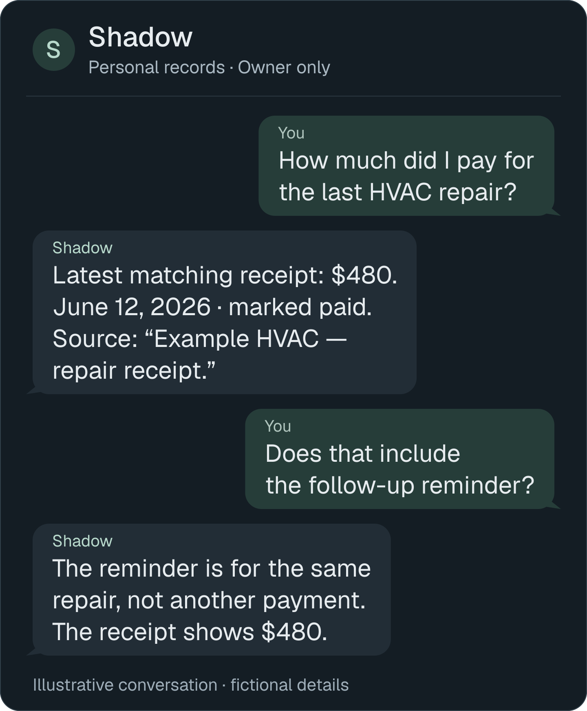

# ShadowOS

My evolving personal assistant for organizing information, working through
ideas and building solutions around everyday needs. Built inside
[OpenClaw](https://github.com/openclaw/openclaw), through WhatsApp and Telegram.

A voice note, photo, video, link or message is the starting point.
The aim: **easy input, useful context, less jumping between tools.**

I'm **Caio Tormin**. I build this with coding agents, use it daily, and keep
extending it for myself, friends and family. Personal project; no public signup yet.

[Examples](#in-conversation) · [How it's built](#how-its-built) · [Explore the project](#explore-the-project)

## Why it exists

During stressful periods, finding forms, invoices and medical information
across apps kept breaking my flow. Even groceries meant searching a WhatsApp
thread while shopping with a child.

I wanted to capture things in the moment and find them when needed—without
maintaining another app or reconstructing the context each time.
[The story and design decisions →](docs/CASE-STUDY.md)

## In conversation

*Illustrative conversations with fictional details.*

### Groceries

**In use:** shared lists with three invited people. 
[Full conversation](docs/CHAT-EXAMPLES.md#groceries-a-video-becomes-a-shared-list)

### Doctor

**Early testing:** the person confirms the search and approves outreach; no appointment booking. 
[Full conversation](docs/CHAT-EXAMPLES.md#doctor-intake-without-repeating-what-was-already-said)

### Personal records

**From context to action:** my personal agent has sent emails and filled out
forms on my behalf using information from **life-index MCP**. For a defective
purchase, it found the order and support contact, extracted the serial number,
explained my photo, sent the inquiry and followed up on the reply.
[Full conversation & tool boundaries](docs/CHAT-EXAMPLES.md#personal-records-find-the-source-behind-the-answer) · [Support illustration](assets/brand/conversation-life-index.svg)

**More exchanges:** [Screenshots](docs/CHAT-EXAMPLES.md#groceries-bring-in-a-note-or-another-conversation) · [What’s missing?](docs/CHAT-EXAMPLES.md#groceries-whats-missing-with-purchase-history) · [Private lists](docs/CHAT-EXAMPLES.md#groceries-keep-a-personal-list-separate) · [Recipes](docs/CHAT-EXAMPLES.md#recipes-personal-telegram-and-invited-whatsapp) · [Doctor replies](docs/CHAT-EXAMPLES.md#doctor-a-reply-is-not-a-booking)

## How it's built

OpenClaw provides the gateway, agent runtime and plugin ecosystem. My custom
work covers conversational workflows, shared state, retrieval, media handling
and access checks.

### Access

| Agent | Available tools |
|:--|:--|
| **Personal · Telegram** | Broader configured OpenClaw tools, including Firecrawl research, calendar capture, email and form filling |
| **Invited · WhatsApp** | Grocery and Doctor only; Doctor remains in early testing |

Life-index supplies read-only context; the personal agent uses its other tools to act on that information.

### Stack & workstation

September 2026 snapshot; version labels distinguish host, review and lockfile.

| Technology | Version / source |
|---|---|
| OpenClaw · Node.js | 2026.9.4 · 24.19.0 — documented host |
| Python · SQLite | 3.12.3 · 3.45.1 — local review |
| TypeScript · Vitest | 5.9.3 · 3.2.7 — Grocery lockfile |
| llama.cpp | b10604 — benchmark runner |
| whisper.cpp · GStreamer | Exact builds not recorded |

**Hardware:** EliteMini · Ryzen 7 8745H · Radeon 780M · ~29 GiB usable RAM · 1 TB NVMe. 
**Configuration:** Ubuntu 24.04.4 LTS, isolated OpenClaw account, loopback gateway,
systemd user services, SQLite, cloud models and local media processing.
[Versions and configuration →](docs/ARCHITECTURE.md#technology-and-version-snapshot)

### Lessons from use

- **Conversation:** short replies and corrections need as much care as the first request.
- **Authority:** models interpret intent; code checks identity, access and approval.
- **Validation:** real conversations expose failures that isolated tests miss.

[Decisions, experiments and lessons →](docs/CASE-STUDY.md#what-real-use-changed)

## Explore the project

| If you want to… | Start here |
|:--|:--|
| Understand the problem and my contribution | [Case study](docs/CASE-STUDY.md) |
| Inspect the implementation | [Architecture](docs/ARCHITECTURE.md) · [Code & setup](tools/README.md) |
| Evaluate evidence and limitations | [Validation](docs/VALIDATION.md) · [Security](docs/SECURITY.md) |
| Contribute or browse further | [Contributing](CONTRIBUTING.md) · [Documentation](docs/README.md) |

**Review snapshot:** 1,174 passing cases; 12 skips. Live workflows and TypeScript
suites were not rerun. Known issues include calendar ordering, concurrent Doctor
sends and a plaintext workstation disk.

Code and synthetic fixtures are [MIT licensed](LICENSE). Personal data stays outside the export.
