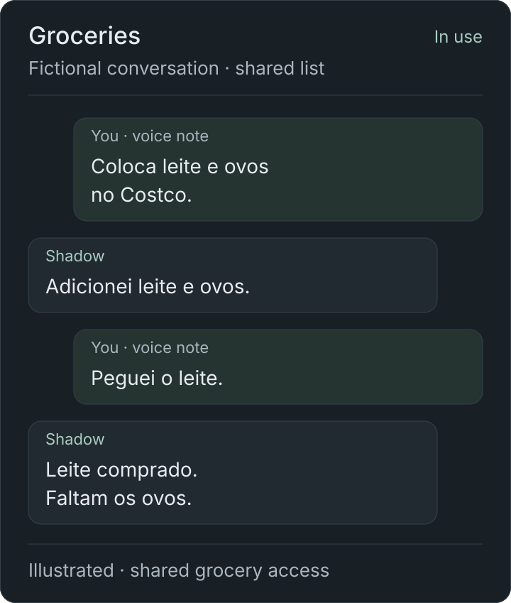
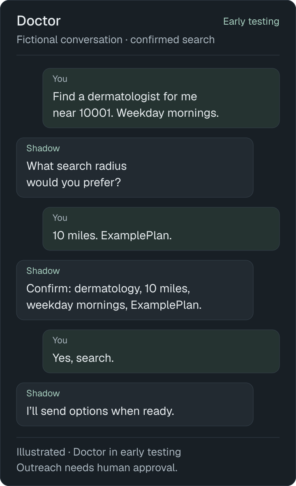
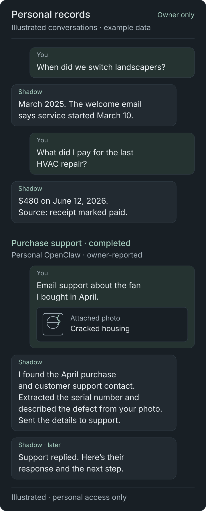
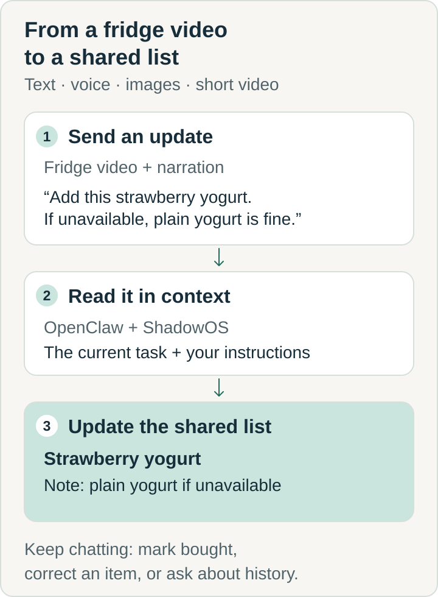

# ShadowOS

**Household tools for the chat apps we already use.**

Send a voice note, show what's in the fridge, or ask about a document.
ShadowOS brings shared grocery lists, personal information retrieval and
an early doctor-search workflow into WhatsApp and Telegram, through
[OpenClaw](https://github.com/openclaw/openclaw).

I'm **Caio Tormin**. I'm building this personal project with coding agents,
using it in daily life and opening up the custom code and what I've learned.
**Grocery tools are used by three invited people. Doctor is in early testing.**
This is a working project on one workstation, with a public code export;
there is no public signup or general installation package yet.

[See conversations](docs/CHAT-EXAMPLES.md) ·
[Read the case study](docs/CASE-STUDY.md) ·
[Explore the code](#explore-the-code)

## What it helps with

| Everyday task | What Shadow does | Current stage |
|---|---|---|
| **Keep a household shopping list current** | Capture items from text and media; share what's needed, bought and still missing | Used by the owner and three invited people |
| **Find and contact a doctor** | Collect preferences, curate providers and prepare an email for the person to review and approve | Early testing; does not book appointments |
| **Find a document or transaction** | Query indexed mail, a document catalog and ledger records grouped by counterparty | Personal use; incomplete extraction coverage |

## A conversation across formats

**01 · Groceries · in use**

<details>
<summary>View the illustrated grocery conversation</summary>



</details>

A short fridge video shows strawberry yogurt, lactose-free milk and eggs.
The member gives the instruction while filming:

> **Member · video + speech:** Coloca esse iogurte, o leite e os ovos na
> lista do Costco. Se não tiver esse iogurte, pode ser o natural.
>
> **Shadow:** Adicionei à lista do **Costco**:\
> 🛒 Iogurte de morango — se não tiver, iogurte natural\
> 🛒 Leite sem lactose\
> 🛒 Ovos
>
> **Member · voice note:** Peguei o leite.
>
> **Shadow:** Marquei o leite sem lactose como comprado. Faltam 2 itens.
>
> **Member:** Na verdade, ainda não peguei.
>
> **Shadow:** Coloquei o leite sem lactose de volta na lista.

The video supplies the products; speech supplies the intent and fallback.
A short correction updates the same list. Screenshots of notes, photos of
conversations and voice replies offer other ways to capture information
without retyping it into another app.

*The conversations and banner are authored illustrations. The grocery list
operations were checked locally; media recognition and conversational
interpretation are illustrated. [Validation details](docs/VALIDATION.md#portfolio-example).*

## A doctor search, with the person in control

**02 · Doctor · early testing**

<details>
<summary>View the illustrated Doctor conversation</summary>



</details>

> **Member:** Find a dermatologist for me near 10001, within 10 miles.
> Weekday mornings work. My plan is ExamplePlan.
>
> **Shadow:** A dermatology appointment for you, within 10 miles of 10001,
> weekday mornings, with ExamplePlan. Shall I search?
>
> **Member:** Yes.
>
> **Shadow:** I'll search and send the options here when they're ready.

*This fictional example illustrates the workflow in early testing.*
The person chooses a practice, verifies their email and reviews the full
outreach draft. Only their direct `/ok CODE` authorizes sending it.
Appointment booking stays with the person.

## Personal records, with the source at hand

**03 · Life-index, mail and ledger · personal access only**

<details>
<summary>View the illustrated personal-records conversation</summary>



</details>

> **Owner:** When did I change to my current landscaper again?
>
> **Shadow:** March 2025. The welcome email says service started on
> March 10. I found it under “Service welcome — Example Lawn.”
>
> **Owner:** How much did I pay for HVAC repair last time?
>
> **Shadow:** The latest matching receipt I found is **$480**, dated
> **June 12, 2026**, and marked paid. Source: “Example HVAC — repair receipt.”

*Dates, amounts, businesses and source titles above are fictional.* The point
is to retrieve an answer with supporting evidence. An invoice alone does not
establish payment, and the latest indexed match may not be the latest event.

My personal Shadow has also handled a defective-product support request:

> **Owner · photo of a cracked fan housing:** Email technical support about
> this defect. It's the fan I bought in April.
>
> **Shadow:** I found the purchase details and customer support contact,
> extracted the serial number, and described the defect from your photo.
> I sent the details to support.
>
> **Shadow · later:** Support replied. Here's their response and the next
> step they're asking for.

**This workflow was completed by my personal OpenClaw agent.** The dialogue
and fan are illustrative; the sequence reflects my reported experience.
It combines purchase retrieval, support-contact discovery, image
interpretation, detail extraction, outbound email and a follow-up when a
reply arrives. Life-index and the other exported context services remain
read-only; they do not implement the complete email workflow.
[More detail and tool boundaries](docs/CHAT-EXAMPLES.md#personal-records-find-the-source-behind-the-answer).

**[More conversations in Portuguese and English →](docs/CHAT-EXAMPLES.md)**

Shared shopping, ambiguous voice updates, purchase history, recipe links
the full Doctor approval flow, personal-record lookups and the personal agent’s
photo-to-support-email workflow.

## Why I built it

During periods of high stress and workload, my attention became a bottleneck.
Payee details, forms, invoices and medical information were scattered across
my phone, Mac, email and provider websites. Finding them would break my flow,
so I postponed the tasks that depended on them.

I also wanted to build useful tools for friends and family. Our grocery list
lived in a WhatsApp thread. Shopping with a child meant repeatedly pulling
out my phone and working out what someone had already bought. Notes and
dedicated apps added another place to maintain information.

That shaped the project: **make input fit the moment, keep shared state
behind the conversation, and ask the person when a decision needs them.**

## The work behind the conversation

<details>
<summary>See how a fridge video becomes a shared list</summary>



The fallback is a note for the shopper. Media interpretation is illustrated;
this does not check store availability or execute a substitution.

</details>

OpenClaw supplies the messaging gateway, agent runtime and plugin ecosystem.
The custom work here covers:

- **Conversation design:** media context, spoken alternatives, short
  corrections and clarification of the unresolved part of a request.
- **Workflow engineering:** shared lists and trip history, provider search
  and approved outreach, mail indexing and document retrieval.
- **Access and operation:** person-specific grants, checks on approval
  commands, local media processing and deployment checks.

The [case study](docs/CASE-STUDY.md) explains the problem, contribution,
design decisions and evidence. The [architecture](docs/ARCHITECTURE.md)
shows the implementation and its boundaries.

## Two access levels

| Agent | Available capabilities |
|---|---|
| **Personal Shadow · Telegram** | Broader configured OpenClaw tools, including Firecrawl web scraping, plus the same grocery functionality |
| **Invited-user Shadow · WhatsApp** | Grocery and doctor-finder tools only; Doctor remains in early testing |

I use the wider OpenClaw setup daily for shopping research, including car
leases, business-idea research and calendar capture from emails, WhatsApp
conversations and medical appointments. My personal agent can read a recipe
with Firecrawl and then add ingredients to the grocery list. Invited users
can supply ingredients as text or screenshots.

This repository contains selected custom work, including the email `.ics`
calendar guardrail. [What's included](docs/HOUSEHOLD-TOOLS.md).

## Tech stack

A September 2026 snapshot of the tools used to build and run the project.
Versions below distinguish the documented host, locked dependencies and the
local review environment; they are not a fully pinned deployment recipe.

| Layer | Technology and version | Role |
|---|---|---|
| Agent runtime | **OpenClaw 2026.9.4** · documented host | Chat integrations, agent runtime and plugin ecosystem |
| JavaScript runtime | **Node.js 24.19.0** · documented host; **24.21.0** · local review | Plugins, routing and Node tests |
| Workflow engines | **Python 3.12.3** · local review | Grocery, Doctor, context services and automations |
| State and retrieval | **SQLite 3.45.1** · Python library in local review | Shared lists, trip history, access state and searchable records |
| Plugin toolchain | **TypeScript 5.9.3**, **Vitest 3.2.7** · Grocery lockfile | Typed adapters and plugin tests |
| Local inference | **llama.cpp b10604** · referenced by the benchmark runner | Bounded local-model experiments |
| Media | **whisper.cpp + GStreamer** · exact builds not recorded in this export | Local speech transcription and video/audio processing |
| Host and scheduling | **Ubuntu 24.04.4 LTS**, systemd user services and timers | One self-hosted workstation |

The wider setup includes cloud models, read-only MCP context tools,
Firecrawl for personal research, and a dedicated AgentMail mailbox for
approved Doctor outreach. [Version sources and compatibility notes](docs/ARCHITECTURE.md#technology-and-version-snapshot).

## Where it runs

One `torm` workstation: **EliteMini series, AMD Ryzen 7 8745H (8 cores /
16 threads), Radeon 780M, about 29 GiB of OS-visible memory, and a 1 TB
Kingston NVMe SSD**, running Ubuntu 24.04.4 LTS. Hardware was checked on
September 15, 2026.

The documented setup uses an isolated OpenClaw account, a loopback gateway,
systemd user services and SQLite. Cloud models handle conversations;
local `llama.cpp` supports bounded text work and `whisper.cpp` transcribes
media. [Hardware and configuration](docs/ARCHITECTURE.md#workstation-and-configuration).

## What I learned along the way

- **Small replies carry important context.** Preserving “sim” and “não” in
  voice transcripts, accepting corrections and retrying only unresolved
  items mattered as much as handling the initial request.
- **Interpretation and authority need different homes.** Models help
  understand a request; trusted identity, membership and approval checks
  belong in code. Sharing a grocery list should not widen someone's tools.
- **Measure before adding another model.** A local sender-classification
  experiment gave way to deterministic code. Missing transaction amounts
  pointed to truncated source snippets and the need for richer input.
- **Test the path people actually use.** Real conversations exposed mode
  loops and transcription failures. The deployed OpenClaw host also differed
  from the plugin's build dependency; passing isolated tests was not enough.
- **Turn operational mistakes into checks.** A deployment that stayed two
  releases behind led to an automated path check. Separate reproductions
  also found calendar-ordering and email-concurrency bugs that remain open.

[Decisions, incidents and their evidence](docs/CASE-STUDY.md#what-real-use-changed)
show how these lessons changed the implementation.

## Evidence and current limits

- **Use:** three invited grocery users, extensive voice-note use and
  purchase-history questions. Time saved and task success are not yet measured.
- **Validation:** the September 15 export review ran 1,186 Python and Node
  cases: 1,174 passed, 12 skipped. TypeScript plugin suites and live workflows
  were not rerun. [Scope and commands](docs/VALIDATION.md).
- **Personal records:** 132,588 indexed messages and 1,813 deduplicated ledger
  events in the private deployment. Extraction precision was 84% on a sample
  of 50 rows; only 28% of ledger rows had an amount. The source data is private.
- **Open issues:** calendar update ordering and concurrent Doctor email sends
  have reproduced failures. The workstation disk is plaintext, and some
  plugin setup dependencies remain incomplete. [Security and limits](docs/SECURITY.md).

Broader conversational planning for calendars, appointments, children's
activities and travel is future work. Today's calendar guardrail handles
the narrower task of importing email invitations.

## Explore the code

| Start here | What you'll find |
|---|---|
| [Case study](docs/CASE-STUDY.md) | Motivation, design and engineering decisions, results and limits |
| [Architecture](docs/ARCHITECTURE.md) | Runtime, data flow, access boundaries and workstation configuration |
| [Tools and test commands](tools/README.md) | Grocery, Doctor, access, media and automations |
| [Contributing](CONTRIBUTING.md) | How to reproduce an issue or propose a focused change |
| [Documentation guide](docs/README.md) | Reading paths and operational references |

```text
tools/             household workflows, plugins, media and automations
layers/openclaw/   mail, ledger and document context services
station/           operator scripts and deployment checks
docs/              case study, examples, architecture and references
```

Code and synthetic fixtures are shared under the [MIT license](LICENSE).
Credentials, household identities, recordings and personal records remain
outside this export. [Publication boundary](docs/PUBLISHING.md).
