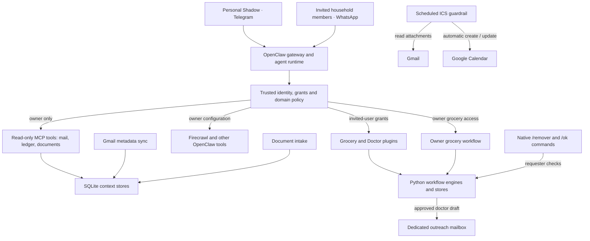
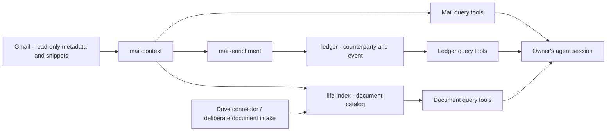

# Architecture

ShadowOS combines an owner-only context service with household workflows in
WhatsApp and Telegram. OpenClaw provides message delivery and the agent
runtime and plugin ecosystem. The owner uses a broad collection of OpenClaw
plugins and tools daily. This export covers selected custom plugins and
Python services that supply workflow state, retrieval and access checks;
it is not the full inventory of the owner's OpenClaw environment.

This describes the deployment represented by the September 2026 export.
Operational paths and model selections below are a snapshot; the dated
runbooks and handoffs retain earlier states.

## System overview

Grocery is in active use by invited household members. Doctor finder is in
early testing and is not fully launched; its presence in the diagram describes
the implemented workflow, not a completed rollout.

The diagram separates model tool calls, native approval commands and a
scheduled automation. Routine grocery additions and purchase updates are
allowed through the tools. Removal and doctor outreach have dedicated
approval paths. The Calendar read-model prototype listed below is separate
from the active ICS automation. See [Security](SECURITY.md) for the controls
and their current limitations.

## Broader daily-use tools

The operator confirms two access levels. Personal Shadow on Telegram can
use Firecrawl and other configured OpenClaw tools, then invoke the same
grocery functionality. Invited-user Shadow on WhatsApp is deliberately
limited to Grocery and Doctor for security; Doctor is still in early testing.
The owner-specific Telegram integration is part of the broader runtime
configuration, not fully described by the exported household adapters.

This permits a personal workflow such as reading a recipe with Firecrawl
and adding its ingredients through groceries. A bare recipe URL in the
invited-user conversation does not confer page-fetch capability.

The owner reports daily use of OpenClaw tools for web scraping and shopping
research (including car-lease comparisons), business-idea research,
and creating calendar events from email, WhatsApp conversations and medical
appointment information. These uses extend beyond the custom code exported
here. A complete plugin inventory and the implementations of all calendar
capture paths are not included in this repository.

The diagram's scheduled ICS path is the specific email-attachment automation
present in the export. It does not establish how the broader calendar tools
parse conversations or authorize writes. The context-service read-only
controls should not be generalized to those other tools.

## Context data flow

## The pieces

The household plugins and media tools are under [`tools/`](../tools/).
Their workflow and configuration details are in
[HOUSEHOLD-TOOLS.md](HOUSEHOLD-TOOLS.md). The table below covers the context
layers, including prototypes retained for reference.

| Layer | What it holds | Lifecycle | Status |
|---|---|---|---|
| [`mail-context`](../layers/openclaw/mail-context/) | Gmail headers, subjects, snippets, labels. Never bodies. FTS5 index. | Disposable cache, synced twice daily, rebuilds in about 30 minutes | Live |
| [`mail-enrichment`](../layers/openclaw/mail-enrichment/) | Sender classification, counterparty resolution, resumable attachment harvester, cross-model QC benchmark | Derived, rebuilt on demand | Live (tooling) |
| [`ledger`](../layers/openclaw/ledger/) | One row per purchase, subscription, booking, appointment, payment, keyed on counterparty | Rebuilt from the index twice daily, atomic swap | Live |
| [`life-index`](../layers/openclaw/life-index/) | Catalog of documents that matter: hash, extracted text, type, tier, structured fields | Deliberate act, a few times a year | Live, MCP server registered |
| [`calendar-context`](../layers/openclaw/calendar-context/) | Read model of Google Calendar with four independent no-write layers | Would sync every 30 minutes | Built and tested, connected to nothing |
| [`drive-context`](../layers/openclaw/drive-context/) | Metadata-only Drive index, content unreachable by construction | Retired 2026-08-25 | Kept for its tests |

The stores have different lifecycles. The mail index syncs twice daily;
the ledger rebuilds from it. The document catalog receives deliberate intake
and remains small. The design treats mail and ledger data as rebuildable
caches of their sources.

## How a chat message becomes an answer

1. A message arrives on Telegram. The OpenClaw gateway runs an agent turn.
2. The agent calls an MCP tool, for example `ledger_entity(name="acme")`.
3. The gateway spawns the MCP server as a subprocess over stdio. The server
   imports nothing outside the standard library, opens SQLite read-only, runs
   one query against a covering index, and answers.
4. The reported local MCP round trip, process spawn to tool answer, is
   32 ms at p50 on the deployment machine. Queries themselves were under
   0.2 ms. This measurement excludes model generation and chat delivery;
   it does not describe end-to-end response time.

The tools return a freshness contract with every answer: last successful
sync, age in seconds, whether the data is stale. Stale context may be
returned. It may never be returned without naming its age.

## The parsing cascade

Turning 132,588 messages into a ledger without 132,588 model calls.

| Layer | Cost | Effect |
|---|---|---|
| 0 · Gmail listing query | free | promotional and social mail never fetched |
| 1 · sender class | free, precomputed | removes 68% of what remains |
| 2 · structural gate | free | labels, attachment shape |
| 3 · learned sender template | free after first learn | extracts fields |
| 4 · local model | about 20 s, once per new sender | learns the template |
| 5 · cloud model | rare | tier-1 documents, lane disagreement |

Two rules make it work. Each layer may only **terminate or extract**, never
merely annotate, or volume never drops. Decisions are cached **per sender**,
not per message: 41 senders cover half of non-promotional mail and 154 cover
80%. Assuming one successful template-learning call per sender gives an
estimated initial budget of about 154 calls. This is not a measured call
count; retries and format changes add work. Templates are
data, not code. They are an ordered rule list per sender, persisted in
SQLite, so a better extractor supersedes rather than overwrites.

Measured on the real corpus: full ledger build 7.1 s, incremental slice of
3,317 messages 1.1 s, output byte-identical between the two.

## Counterparty identity

Amazon sends from 21 addresses, Apple from 38. The unit the owner thinks in is
the merchant or the person, so `entities.resolve()` maps any `From:` header to
one key: `merchant:<registrable-domain>`, `person:<address>`, `self:<address>`,
or `platform:<sending-service>`. Public-suffix rules matter: a naive root-domain
collapse merged 112 Brazilian addresses into one fake merchant. The same key
is used by the ledger and by the document catalog, and a test asserts the
format matches, so the two stores can join on it.

## Model configuration in the deployment snapshot

Cloud models stay primary and are selected per session by alias:

| Alias | Model | Use |
|---|---|---|
| `quick` | `openai/gpt-5.6-luna` | short, cheap turns |
| `work` | `anthropic/claude-sonnet-5` | default reasoning |
| `deep` | `openai/gpt-5.6-sol` | long analysis |

An explicit selection is strict: if that model is unavailable the run fails
visibly rather than silently falling back. The automatic fallback chain is
cloud-only and cross-provider.

Local inference is separate and explicit-only, through a pinned standalone
`llama.cpp` build with SHA-256-verified weights, served on loopback with at
most one model resident: Qwen3.5 9B for extraction and classification,
Gemma 4 26B A4B for higher-quality private drafting, Qwen3 14B as the strongest
Brazilian-Portuguese lane. Local models have tool use disabled. They are
scoped to bounded text tasks, never autonomous workflows.

Where a model sits in the pipeline was decided by measurement. Sender
classification was benchmarked at 0.864 agreement with a local model and then
solved deterministically at zero cost, so the model was dropped. Only 28% of
ledger rows carry an amount, and that is snippet truncation rather than
extraction failure, so fetching bodies comes before any new model lane.

## Workstation and configuration

The hardware below was read directly from `torm` on September 15, 2026,
without accessing production credentials or gateway configuration.

| Component | Observed configuration |
|---|---|
| Workstation | EliteMini Series, as reported by system firmware |
| CPU | AMD Ryzen 7 8745H, 8 cores / 16 threads, x86-64 |
| Graphics | Integrated Radeon 780M; PCI inventory identifies AMD Phoenix3 |
| Memory | Approximately 29.2 GiB visible to Linux; this is usable memory, not a DIMM-capacity inventory |
| Storage | Kingston OM8TAP41024K1-A00 NVMe SSD, approximately 1 TB decimal capacity |
| OS | Ubuntu 24.04.4 LTS |
| Kernel | `7.0.0-30-generic` |

The software arrangement below comes from the deployment documentation;
this hardware check did not re-audit the live gateway:

| Area | Configuration |
|---|---|
| Runtime | OpenClaw on Node 24 under the isolated `openclaw` Linux account |
| Channels | Owner and household WhatsApp accounts, plus Telegram, with separate allowlists |
| Network | Gateway on loopback with token authentication; private remote access through Tailscale and SSH |
| Models | Cloud models for agent conversations; local `llama.cpp` for bounded tasks with tool use disabled |
| Media | Local `whisper.cpp` transcription with time and concurrency limits |
| State | SQLite stores for context, household workflows, access and modes |
| Scheduling | systemd user services and timers for sync and background jobs |
| Storage protection | Plaintext disk under an explicit operator waiver; see [Security](SECURITY.md#6-encryption-at-rest-waived-not-passed) |

The integrated GPU's presence does not establish that each local inference
path uses GPU acceleration. This is a single-machine configuration; the
latency measurements elsewhere in this document describe that deployment.

## Deployment shape

- **No root daemons, no containers.** Everything is a systemd *user* unit
  under an isolated service account with no sudo. Code is deployed by copying
  a directory from this repo.
- **Standard-library Python context packages.** There is no
  `requirements.txt` because there is nothing to install. Gmail and Calendar
  are reached with `urllib.request` against the REST API. Optional
  out-of-process tools (`pdftotext`, Docling for scans, `gocryptfs`) are
  invoked as subprocesses so the packages stay copy-installable. The
  TypeScript household plugins have separate SDK and build dependencies;
  these claims do not describe the whole application.
- **Context-layer units use `%h`.** Their path check was added after a
  deployment remained two releases behind. Household operator scripts and
  doctor units retain deployment-specific paths and need separate review
  before reuse.
- **Honest about systemd.** `ProtectHome=` does nothing in an unprivileged
  `--user` unit here; it was measured, a unit carrying it wrote freely to
  `$HOME`. `ProtectKernelModules=` fails such a unit with `218/CAPABILITIES`.
  The unit files say so instead of carrying directives that look like
  hardening and are not.

## Where things live on the deployment machine

| Thing | Path |
|---|---|
| Gateway config, sessions, state | `/home/openclaw/.openclaw/` (mode 0700) |
| Deployed layer code | `/home/openclaw/<layer>/`, a copy of `layers/openclaw/<layer>/` |
| OAuth client, token, encryption waiver | `/home/openclaw/.config/mail-context/` |
| Indexes | `/home/openclaw/.local/state/<layer>/*.sqlite`, mode 0600 |
| Operator wrapper | `station/scripts/openclaw-prod` |

`torm` is the workstation's hostname and `caio` the operator account. They
appear throughout the docs because the docs describe a real deployment rather
than a hypothetical one.
