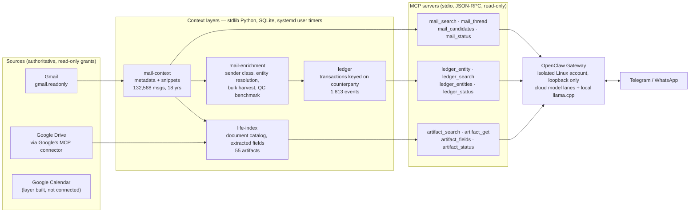

# Architecture

A self-hosted chat agent that can answer questions about your own mail,
transactions and documents, without ever being able to send, edit or delete
anything.

## The pieces

| Layer | What it holds | Lifecycle | Status |
|---|---|---|---|
| [`mail-context`](../layers/openclaw/mail-context/) | Gmail headers, subjects, snippets, labels. Never bodies. FTS5 index. | Disposable cache, synced twice daily, rebuilds in about 30 minutes | Live |
| [`mail-enrichment`](../layers/openclaw/mail-enrichment/) | Sender classification, counterparty resolution, resumable attachment harvester, cross-model QC benchmark | Derived, rebuilt on demand | Live (tooling) |
| [`ledger`](../layers/openclaw/ledger/) | One row per purchase, subscription, booking, appointment, payment, keyed on counterparty | Rebuilt from the index twice daily, atomic swap | Live |
| [`life-index`](../layers/openclaw/life-index/) | Catalog of documents that matter: hash, extracted text, type, tier, structured fields | Deliberate act, a few times a year | Live, MCP wiring staged |
| [`calendar-context`](../layers/openclaw/calendar-context/) | Read model of Google Calendar with four independent no-write layers | Would sync every 30 minutes | Built and tested, connected to nothing |
| [`drive-context`](../layers/openclaw/drive-context/) | Metadata-only Drive index, content unreachable by construction | Retired 2026-08-25 | Kept for its tests |

Three stores, three lifecycles, deliberately not one database. The ledger is
weekly and needs no filing because it is fed from mail that already arrives.
The catalog is yearly and needs a deliberate act, which is why it stays small.

## How a chat message becomes an answer

1. A message arrives on Telegram. The OpenClaw gateway runs an agent turn.
2. The agent calls an MCP tool, for example `ledger_entity(name="acme")`.
3. The gateway spawns the MCP server as a subprocess over stdio. The server
   imports nothing outside the standard library, opens SQLite read-only, runs
   one query against a covering index, and answers.
4. The whole round trip, spawn to answer, is 32 ms at p50 on the deployment
   machine. Queries themselves are under 0.2 ms. Process startup is the
   entire cost, which is the concrete reason the query path is stdlib-only.

The tools return a freshness contract with every answer: last successful
sync, age in seconds, whether the data is stale. Stale context may be
returned. It may never be returned without naming its age.

## The parsing cascade

Turning 132,588 messages into a ledger without 132,588 model calls.

| Layer | Cost | Effect |
|---|---|---|
| 0 · Gmail listing query | free | promotional and social mail never fetched |
| 1 · sender class | free, precomputed | removes 68% of what remains |
| 2 · structural gate | free | labels, attachment shape |
| 3 · learned sender template | free after first learn | extracts fields |
| 4 · local model | about 20 s, once per new sender | learns the template |
| 5 · cloud model | rare | tier-1 documents, lane disagreement |

Two rules make it work. Each layer may only **terminate or extract**, never
merely annotate, or volume never drops. Decisions are cached **per sender**,
not per message: 41 senders cover half of non-promotional mail and 154 cover
80%, so the model budget is about 154 calls rather than 20,250. Templates are
data, not code. They are an ordered rule list per sender, persisted in
SQLite, so a better extractor supersedes rather than overwrites.

Measured on the real corpus: full ledger build 7.1 s, incremental slice of
3,317 messages 1.1 s, output byte-identical between the two.

## Counterparty identity

Amazon sends from 21 addresses, Apple from 38. The unit the owner thinks in is
the merchant or the person, so `entities.resolve()` maps any `From:` header to
one key: `merchant:<registrable-domain>`, `person:<address>`, `self:<address>`,
or `platform:<sending-service>`. Public-suffix rules matter: a naive root-domain
collapse merged 112 Brazilian addresses into one fake merchant. The same key
is used by the ledger and by the document catalog, and a test asserts the
format matches, so the two stores can join on it.

## Model lanes

Cloud models stay primary and are selected per session by alias:

| Alias | Model | Use |
|---|---|---|
| `quick` | `openai/gpt-5.6-luna` | short, cheap turns |
| `work` | `anthropic/claude-sonnet-5` | default reasoning |
| `deep` | `openai/gpt-5.6-sol` | long analysis |

An explicit selection is strict: if that model is unavailable the run fails
visibly rather than silently falling back. The automatic fallback chain is
cloud-only and cross-provider.

Local inference is separate and explicit-only, through a pinned standalone
`llama.cpp` build with SHA-256-verified weights, served on loopback with at
most one model resident: Qwen3.5 9B for extraction and classification,
Gemma 4 26B A4B for higher-quality private drafting, Qwen3 14B as the strongest
Brazilian-Portuguese lane. Local models have tool use disabled. They are
scoped to bounded text tasks, never autonomous workflows.

Where a model sits in the pipeline was decided by measurement. Sender
classification was benchmarked at 0.864 agreement with a local model and then
solved deterministically at zero cost, so the model was dropped. Only 28% of
ledger rows carry an amount, and that is snippet truncation rather than
extraction failure, so fetching bodies comes before any new model lane.

## Deployment shape

- **No root daemons, no containers.** Everything is a systemd *user* unit
  under an isolated service account with no sudo. Code is deployed by copying
  a directory from this repo.
- **Zero third-party dependencies** in every layer. There is no
  `requirements.txt` because there is nothing to install. Gmail and Calendar
  are reached with `urllib.request` against the REST API. Optional
  out-of-process tools (`pdftotext`, Docling for scans, `gocryptfs`) are
  invoked as subprocesses so the packages stay copy-installable.
- **Units use `%h`, never a literal home path.** A check script fails the
  commit if a tracked unit reintroduces one, because a unit once sat two
  releases behind its deployed copy for exactly that reason.
- **Honest about systemd.** `ProtectHome=` does nothing in an unprivileged
  `--user` unit here; it was measured, a unit carrying it wrote freely to
  `$HOME`. `ProtectKernelModules=` fails such a unit with `218/CAPABILITIES`.
  The unit files say so instead of carrying directives that look like
  hardening and are not.

## Where things live on the deployment machine

| Thing | Path |
|---|---|
| Gateway config, sessions, state | `/home/openclaw/.openclaw/` (mode 0700) |
| Deployed layer code | `/home/openclaw/<layer>/`, a copy of `layers/openclaw/<layer>/` |
| OAuth client, token, encryption waiver | `/home/openclaw/.config/mail-context/` |
| Indexes | `/home/openclaw/.local/state/<layer>/*.sqlite`, mode 0600 |
| Operator wrapper | `station/scripts/openclaw-prod` |

`torm` is the workstation's hostname and `caio` the operator account. They
appear throughout the docs because the docs describe a real deployment rather
than a hypothetical one.
